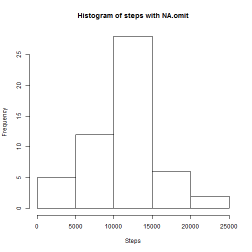
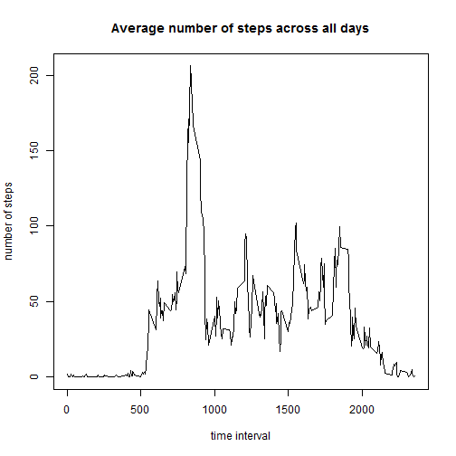
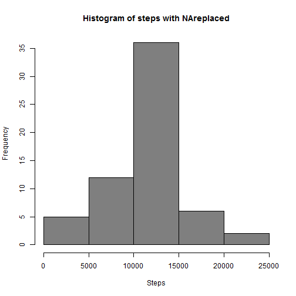

This is an R Markdown document for Peer Assessment-1 in Course "Reproducable Research". 

Loading and preprocessing the data

First, Load the data


```r
data <- read.csv("activity.csv")
```

What is mean total number of steps taken per day?

For this analysis, omit the NAs from the original data, then calculate the total number of steps taken per day.


```r
data2 <- na.omit(data)
sumNArm <- aggregate(steps ~ date, data2, sum)
```

Make a histogram of the total number of steps taken each day

```r
hist(sumNArm$steps, main="Histogram of steps with NA.omit", xlab = "Steps")
```

 

Calculate and report the mean and median total number of steps taken per day

```r
library(plyr)
meanNArm <- mean(sumNArm$steps)
head(meanNArm)
```

```
## [1] 10766.19
```

```r
medianNArm <- median(sumNArm$steps)
head(medianNArm)
```

```
## [1] 10765
```

What is the average daily activity pattern?

First, calculate the average number of steps taken per 5-minute interval across all days.

```r
meanbyinterval <- aggregate(steps ~ interval, data2, mean)
```

Then, make a time series plot of the average number of steps taken


```r
plot(steps ~ interval, data=meanbyinterval,type = "l", xlab = "time interval", 
    ylab = "number of steps", main = "Average number of steps across all days")
```

 

Find the 5-minute interval which contains the maximu number of steps across all the days.

```r
meanbyinterval[which.max(meanbyinterval[,2]),]
```

```
##     interval    steps
## 104      835 206.1698
```
The 5-minute interval which contains the maximum number of steps on average across all the days is 835.

Imputing missing values

Calculate and report the total number of missing values in the dataset

```r
numNA <- sum(is.na(data))
numNA
```

```
## [1] 2304
```

Replace the missing values with the mean for that 5-minute interval, which will create a new dataset that is equal to the original dataset but with the missing data filled in.

```r
dataNAreplaced <- data
for (i in 1:17568)
  
  {if (!(is.na(dataNAreplaced[i,1]))){next}
   else { if (i%%288 != 0) {dataNAreplaced[i,1] <- meanbyinterval[i%%288,2]}
        else {dataNAreplaced[i,1] <- meanbyinterval[288,2]}}
  }

sumNAreplaced <-aggregate(steps ~ date, dataNAreplaced, sum)
head(sumNAreplaced)
```

```
##         date    steps
## 1 2012-10-01 10766.19
## 2 2012-10-02   126.00
## 3 2012-10-03 11352.00
## 4 2012-10-04 12116.00
## 5 2012-10-05 13294.00
## 6 2012-10-06 15420.00
```

Make a histogram of the total number of steps taken each day from the clean dataset.


```r
 hist(sumNAreplaced$steps, main="Histogram of steps with NAreplaced", xlab = "Steps", col="gray50")
```

 

Then, calculate and report the mean and median total number of steps taken per day. 

```r
meanNAreplaced <- mean(sumNAreplaced$steps)
print(meanNAreplaced)
```

```
## [1] 10766.19
```

```r
medianNAreplaced <- median(sumNAreplaced$steps)
print(medianNAreplaced)
```

```
## [1] 10766.19
```

Both the mean total number of steps taken per day are 10766, which is the same as the estimates from the first part of the assignment. The median 10766, is very close to that from the estimate from the first part, 10765.

No significant difference in distribution is found after inputting missing values, so inputing missing values with the mean for that 5-minute interval does not impact the distribution pattern of number of steps.


Are there differences in activity patterns between weekdays and weekends?

Create a new factor variable in the dataset with the filled-in missing values with two levels -- "weekday" and "weekend" indicating whether a given date is a weekday or weekend day.

```r
dataNAreplaced$daytype <- ifelse (weekdays(as.Date(dataNAreplaced[,2])) %in% c("Saturday","Sunday"), "weekend","weekday")
dataNAreplaced$daytype <- factor(dataNAreplaced$daytype)
head(dataNAreplaced)
```

```
##       steps       date interval daytype
## 1 1.7169811 2012-10-01        0 weekday
## 2 0.3396226 2012-10-01        5 weekday
## 3 0.1320755 2012-10-01       10 weekday
## 4 0.1509434 2012-10-01       15 weekday
## 5 0.0754717 2012-10-01       20 weekday
## 6 2.0943396 2012-10-01       25 weekday
```

Make a panel plot containing a time series plot (i.e. type = "l") of the 5-minute interval (x-axis) and the average number of steps taken, averaged across all weekday days or weekend days (y-axis). 


```r
library(dplyr)
```

```
## 
## Attaching package: 'dplyr'
## 
## The following objects are masked from 'package:plyr':
## 
##     arrange, count, desc, failwith, id, mutate, rename, summarise,
##     summarize
## 
## The following object is masked from 'package:stats':
## 
##     filter
## 
## The following objects are masked from 'package:base':
## 
##     intersect, setdiff, setequal, union
```

```r
datagrouped <- dataNAreplaced %>% group_by(interval, daytype) %>% summarise(meanSteps = mean(steps, na.rm=TRUE))

library(lattice)
daytypeplot <- xyplot(meanSteps ~ interval | daytype, datagrouped, type = "l", 
    layout = c(1, 2), xlab = "Interval", ylab = "Number of steps")
daytypeplot
```

 
